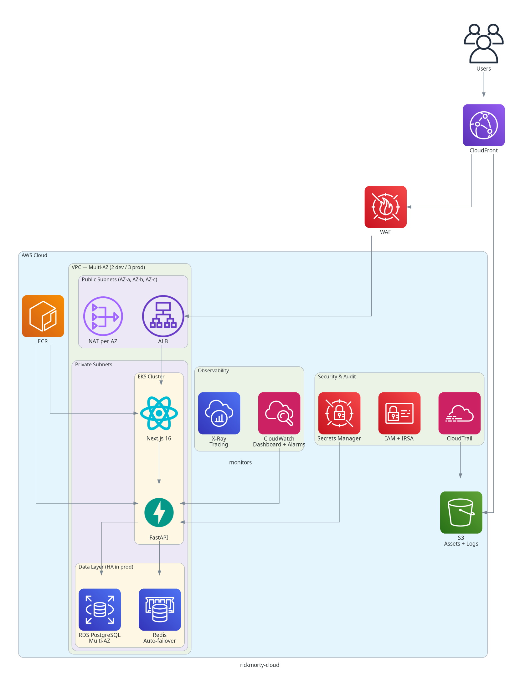

# rickmorty-cloud

> Rick and Morty Explorer on AWS — 14 Terraform modules, EKS, RDS, Redis, S3, CloudFront, WAF, X-Ray, and more

**Status: Infrastructure code complete. Pending AWS deployment and live testing.**

All Terraform modules are written, validated (`terraform validate`), and security-scanned (tfsec + checkov). The app (FastAPI + Next.js) is tested locally with 13 passing tests. AWS deployment is next.

A complete cloud platform that deploys a Rick and Morty Explorer app (FastAPI + Next.js) on AWS EKS, with every production service you'd expect: database, cache, CDN, firewall, audit trail, tracing, monitoring, and secrets management.

## Architecture



## Why This Project

This is how real companies run on AWS. Every module follows AWS Well-Architected best practices:

- **16 Terraform modules** — VPC, EKS, IAM, ALB, RDS, Redis, S3, CloudFront, WAF, CloudTrail, ECR, Secrets Manager, CloudWatch, X-Ray, Compliance
- **SOC 2 ready** — AWS Config (6 rules), GuardDuty threat detection, CloudTrail audit, SNS security alerts
- **One-command deploy** — Docker container handles all prerequisites, `make deploy` does everything
- **Remote state** — S3 with KMS encryption + DynamoDB locking
- **Multi-environment** — Dev (spot, 2 AZs, minimal) vs Prod (on-demand, 3 AZs, HA)
- **High availability** — Multi-AZ RDS, Redis auto-failover, NAT per AZ, min 3 nodes in prod
- **Security** — WAF (managed rules + rate limiting), KMS encryption, IRSA, VPC flow logs, CloudTrail, GuardDuty, non-root containers, ECR scan-on-push, Secrets Manager
- **Observability** — CloudWatch dashboards + alarms, X-Ray distributed tracing, SNS notifications
- **Cost optimization** — Spot instances in dev, S3 lifecycle policies (Standard → IA → Glacier)

## The App

**Rick and Morty Explorer** — browse characters from the Rick and Morty API, search, and save favorites to PostgreSQL. Cached with Redis, served via CloudFront.

| Layer | Technology |
|-------|-----------|
| Frontend | Next.js 16 + TypeScript + Tailwind CSS + shadcn/ui + pnpm |
| Backend | FastAPI + Python 3.12 + Poetry |
| Database | RDS PostgreSQL 16 (encrypted, automated backups) |
| Cache | ElastiCache Redis 7.1 |
| Storage | S3 + CloudFront CDN |

## AWS Services

| Service | Module | Purpose |
|---------|--------|---------|
| **EKS** | `modules/eks` | Kubernetes cluster, managed node groups, OIDC, KMS envelope encryption |
| **VPC** | `modules/vpc` | Public/private subnets, NAT Gateway per AZ, VPC Flow Logs to CloudWatch |
| **IAM** | `modules/iam` | Cluster/node roles, IRSA for ALB Controller + External Secrets Operator |
| **ALB** | `modules/alb` | AWS Load Balancer Controller via Helm |
| **RDS** | `modules/rds` | PostgreSQL 16, encrypted at rest, automated backups, multi-AZ (prod) |
| **ElastiCache** | `modules/redis` | Redis 7.1 cache layer |
| **S3** | `modules/s3` | Asset storage, versioning, lifecycle policies (→ IA → Glacier), IRSA policy |
| **CloudFront** | `modules/cloudfront` | CDN with Origin Access Control, HTTPS redirect, WAF integration |
| **WAF** | `modules/waf` | AWS Managed Rules (Common + Bad Inputs), IP rate limiting |
| **CloudTrail** | `modules/cloudtrail` | API audit trail to encrypted S3 bucket |
| **ECR** | `modules/ecr` | Container registry, scan-on-push, immutable tags, lifecycle (keep last 10) |
| **Secrets Manager** | `modules/secrets` | App secrets + External Secrets Operator K8s manifests |
| **CloudWatch** | `modules/observability` | Dashboard (EKS CPU, RDS CPU, ALB requests, Redis hits), alarms (high CPU, 5xx) |
| **X-Ray** | `modules/observability` | Distributed tracing with sampling rules and trace groups |
| **AWS Config** | `modules/compliance` | 6 compliance rules (encryption, public access, MFA, CloudTrail) |
| **GuardDuty** | `modules/compliance` | Threat detection and continuous security monitoring |
| **SNS** | `modules/compliance` | Security alert notifications to email |
| **SSM Parameter Store** | `modules/parameter-store` | Non-secret config per environment (log level, cache TTL, CORS) |

## Dev vs Prod

| | Dev | Prod |
|--|-----|------|
| AZs | 2 | 3 |
| Nodes | t3.small SPOT (1-4) | t3.large ON_DEMAND (3-10) |
| RDS | db.t3.micro, single AZ | db.t3.medium, multi-AZ, 14-day backups |
| Redis | cache.t3.micro, single node | cache.t3.small, 1 replica, auto-failover, multi-AZ |
| NAT Gateway | 1 per AZ (2) | 1 per AZ (3) |
| WAF rate limit | 2,000 req/5min | 5,000 req/5min |
| EKS API | Public | Private only |
| VPC CIDR | 10.0.0.0/16 | 10.1.0.0/16 |

## Prerequisites

- **Docker** — that's it. Everything else runs inside the deploy container.
- An AWS account with IAM credentials.

## Usage

### 1. Set your AWS credentials

```bash
export AWS_ACCESS_KEY_ID=your-key
export AWS_SECRET_ACCESS_KEY=your-secret
export AWS_DEFAULT_REGION=us-east-1
```

### 2. Deploy everything (one command)

```bash
make deploy
```

This single command:
1. Builds a Docker container with all prerequisites (Terraform, kubectl, Helm, AWS CLI)
2. Creates the S3 backend for Terraform state (skips if already exists)
3. Deploys all AWS services (VPC, EKS, RDS, Redis, S3, CloudFront, WAF, CloudTrail, ECR, Secrets Manager, CloudWatch, X-Ray, Config, GuardDuty)
4. Generates a secure DB password automatically
5. Builds and pushes app images to ECR (auto-login)
6. Installs the Helm chart (Deployments, Services, Ingress, HPA, PDB, NetworkPolicies)
7. Shows the ALB URL to access the app

### 3. Check status

```bash
make status
```

### 4. Destroy when done

```bash
make destroy
```

### All commands

```bash
make deploy         # Deploy everything to dev (infra + app)
make deploy-prod    # Deploy everything to prod
make infra          # Deploy only infrastructure (no images)
make push           # Build and push images to ECR
make status         # Show cluster status and outputs
make destroy        # Destroy dev environment
make destroy-prod   # Destroy prod environment
make test           # Run API tests locally
make lint           # Lint API code locally
make validate       # Validate Terraform locally
```

## CI/CD

Every push to `main` or `develop` runs 5 parallel jobs:

| Job | What it does |
|-----|-------------|
| lint-test-backend | ruff lint + 13 pytest tests |
| build-backend | Docker build + Trivy CVE scan |
| build-frontend | Docker build + Trivy CVE scan |
| terraform-validate | fmt + init + validate (dev & prod) |
| terraform-security | tfsec + checkov scan all modules |

## Project Structure

```
rickmorty-cloud/
├── deploy/                        # Deploy container (Dockerfile + script)
├── backend/                       # S3 + DynamoDB for Terraform remote state
├── modules/
│   ├── vpc/                       # VPC, subnets, NAT, IGW, flow logs
│   ├── eks/                       # EKS, node groups, OIDC, KMS
│   ├── iam/                       # Roles, IRSA (ALB, External Secrets)
│   ├── alb/                       # AWS Load Balancer Controller
│   ├── rds/                       # PostgreSQL 16, encrypted, backups
│   ├── redis/                     # ElastiCache Redis 7.1
│   ├── s3/                        # Asset bucket + lifecycle + IRSA policy
│   ├── cloudfront/                # CDN + OAC + S3 policy
│   ├── waf/                       # Managed rules + rate limiting
│   ├── cloudtrail/                # API audit to S3
│   ├── ecr/                       # Container registry, scan-on-push
│   ├── secrets/                   # Secrets Manager + External Secrets
│   ├── observability/             # CloudWatch dashboard + alarms + X-Ray
│   ├── compliance/                # AWS Config (6 rules) + GuardDuty + SNS alerts
│   └── parameter-store/           # SSM Parameter Store (config per environment)
├── environments/
│   ├── dev/                       # Spot, 2 AZs, minimal
│   └── prod/                      # On-demand, 3 AZs, HA
├── helm/rickmorty/                # Helm chart for app deployment
│   ├── templates/                 # Deployments, Services, Ingress, HPA, PDB, NetworkPolicies
│   ├── values.yaml                # Dev defaults
│   └── values-prod.yaml           # Prod overrides (more replicas, resources)
├── app/
│   ├── backend/                   # FastAPI + Poetry + 13 tests
│   └── frontend/                  # Next.js 16 + shadcn/ui + dark mode
├── .github/workflows/ci.yml      # 5 parallel CI jobs
└── Makefile                       # make deploy / make destroy
```

## License

MIT
