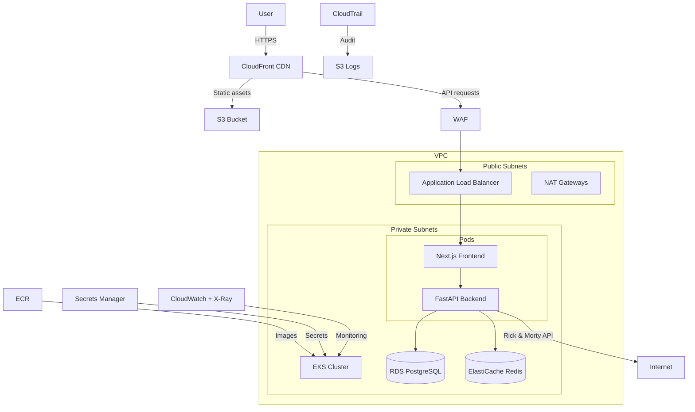

# rickmorty-cloud

> Rick and Morty Explorer on AWS — 12 Terraform modules, EKS, RDS, Redis, S3, CloudFront, WAF, and more

**Status: Infrastructure code complete. Pending AWS deployment and live testing.**

All 12 Terraform modules are written, validated (`terraform validate`), and security-scanned. The app (FastAPI + Next.js) is tested locally with 13 passing tests. AWS deployment is next.

A complete cloud platform that deploys a Rick and Morty Explorer app (FastAPI + Next.js) on AWS EKS, with every production service you'd expect: database, cache, CDN, firewall, audit trail, monitoring, and secrets management.

## Why This Project

This is how real companies run on AWS. Every module follows AWS Well-Architected best practices:

- **12 Terraform modules** — VPC, EKS, IAM, ALB, RDS, Redis, S3, CloudFront, WAF, CloudTrail, ECR, Observability
- **Remote state** — S3 with KMS encryption + DynamoDB locking
- **Multi-environment** — Dev (spot, 2 AZs, $minimal) vs Prod (on-demand, 3 AZs, HA)
- **Security** — WAF, KMS encryption, IRSA, VPC flow logs, CloudTrail, non-root containers, ECR scan-on-push
- **Observability** — CloudWatch dashboards + alarms, X-Ray tracing, Prometheus
- **Cost optimization** — Spot instances in dev, S3 lifecycle policies, ElastiCache free tier

## Architecture



## The App

**Rick and Morty Explorer** — browse characters from the Rick and Morty API, search, and save favorites to PostgreSQL. Images cached in Redis, served via CloudFront.

| Layer | Technology |
|-------|-----------|
| Frontend | Next.js 16 + TypeScript + Tailwind CSS + shadcn/ui + pnpm |
| Backend | FastAPI + Python 3.12 |
| Database | RDS PostgreSQL 16 (free tier) |
| Cache | ElastiCache Redis 7.1 (free tier) |
| Storage | S3 + CloudFront CDN |

## AWS Services Used

| Service | Module | Purpose |
|---------|--------|---------|
| **EKS** | `modules/eks` | Kubernetes cluster + managed node groups |
| **VPC** | `modules/vpc` | Networking: public/private subnets, NAT, flow logs |
| **IAM** | `modules/iam` | Cluster/node roles, IRSA for ALB + External Secrets |
| **ALB** | `modules/alb` | Load Balancer Controller via Helm |
| **RDS** | `modules/rds` | PostgreSQL 16, encrypted, automated backups |
| **ElastiCache** | `modules/redis` | Redis 7.1 cache (free tier) |
| **S3** | `modules/s3` | Asset storage with lifecycle policies + versioning |
| **CloudFront** | `modules/cloudfront` | CDN with OAC for S3, HTTPS redirect |
| **WAF** | `modules/waf` | Managed rules + rate limiting on ALB |
| **CloudTrail** | `modules/cloudtrail` | API audit trail to S3 |
| **ECR** | `modules/ecr` | Container registry, scan-on-push, immutable tags |
| **Secrets Manager** | `modules/secrets` | App secrets + External Secrets Operator manifests |
| **CloudWatch** | `modules/observability` | Dashboard, alarms (CPU, 5xx), X-Ray tracing |

## Dev vs Prod

| | Dev | Prod |
|--|-----|------|
| AZs | 2 | 3 |
| Nodes | t3.medium SPOT (1-4) | t3.large ON_DEMAND (3-10) |
| RDS | db.t3.micro, single AZ | db.t3.medium, multi AZ |
| API endpoint | Public | Private |
| VPC CIDR | 10.0.0.0/16 | 10.1.0.0/16 |

## Prerequisites

- [AWS CLI](https://docs.aws.amazon.com/cli/latest/userguide/install-cliv2.html) configured with credentials
- [Terraform](https://www.terraform.io/) >= 1.5
- [kubectl](https://kubernetes.io/docs/tasks/tools/)
- [Docker](https://www.docker.com/) (to build and push images)
- [Helm](https://helm.sh/) (for ALB Controller)

### AWS credentials

```bash
aws configure
# AWS Access Key ID: your-key
# AWS Secret Access Key: your-secret
# Default region: us-east-1
# Default output: json
```

Your IAM user needs permissions for: EKS, EC2, VPC, RDS, ElastiCache, S3, CloudFront, WAF, CloudTrail, Secrets Manager, ECR, CloudWatch, IAM, DynamoDB, KMS.

## Usage

### 1. Configure the DB password

```bash
export TF_VAR_db_password="YourSecurePassword123!"
```

### 2. Create remote backend (once)

```bash
make init-backend
```

### 3. Preview what will be created (free)

```bash
make plan-dev
```

### 4. Deploy

```bash
make apply-dev
```

### 5. Push app images to ECR

```bash
# Get ECR URLs from output
make show-dev

# Login to ECR
aws ecr get-login-password --region us-east-1 | docker login --username AWS --password-stdin <account-id>.dkr.ecr.us-east-1.amazonaws.com

# Build and push
docker build -t <ecr-url>/backend:v1 app/backend/
docker push <ecr-url>/backend:v1

docker build -t <ecr-url>/frontend:v1 app/frontend/
docker push <ecr-url>/frontend:v1
```

### 6. Connect to the cluster

```bash
aws eks update-kubeconfig --name eks-platform-dev --region us-east-1
kubectl get nodes
```

### 7. Access the app

```bash
# CloudFront URL (for static assets)
terraform -chdir=environments/dev output cloudfront_domain

# ALB URL (for the app)
kubectl get ingress -A
```

### 8. Destroy when done

```bash
make destroy-dev
```

### All commands

```bash
make fmt            # Format all .tf files
make validate       # Validate all environments
make plan-dev       # Preview dev changes
make apply-dev      # Deploy dev
make show-dev       # Show outputs
make destroy-dev    # Tear down dev
make plan-prod      # Preview prod changes
make apply-prod     # Deploy prod
make destroy-prod   # Tear down prod
```

## CI/CD

Every push to `main` or `develop` runs 5 parallel jobs:

| Job | What it does |
|-----|-------------|
| lint-test-backend | ruff lint + 13 pytest tests |
| build-backend | Docker build + Trivy CVE scan |
| build-frontend | Docker build + Trivy CVE scan |
| terraform-validate | fmt + init + validate (dev & prod) |
| terraform-security | tfsec + checkov scan all modules |

## Project Structure

```
aws/
├── backend/                     # S3 + DynamoDB remote state
├── modules/
│   ├── vpc/                     # VPC, subnets, NAT, IGW, flow logs
│   ├── eks/                     # EKS, node groups, OIDC, KMS
│   ├── iam/                     # Roles, IRSA (ALB, External Secrets)
│   ├── alb/                     # AWS Load Balancer Controller
│   ├── rds/                     # PostgreSQL 16, encrypted, backups
│   ├── redis/                   # ElastiCache Redis 7.1
│   ├── s3/                      # Asset bucket + lifecycle + IRSA policy
│   ├── cloudfront/              # CDN + OAC + S3 policy
│   ├── waf/                     # Managed rules + rate limiting
│   ├── cloudtrail/              # API audit to S3
│   ├── ecr/                     # Container registry, scan-on-push
│   ├── secrets/                 # Secrets Manager + External Secrets
│   └── observability/           # CloudWatch dashboard + alarms + X-Ray
├── environments/
│   ├── dev/                     # Spot, 2 AZs, minimal
│   └── prod/                    # On-demand, 3 AZs, HA
├── app/
│   ├── backend/                 # FastAPI (Rick and Morty API + favorites)
│   └── frontend/                # Next.js 16 + shadcn/ui
├── .github/workflows/ci.yml
├── Makefile
└── README.md
```

## License

MIT
